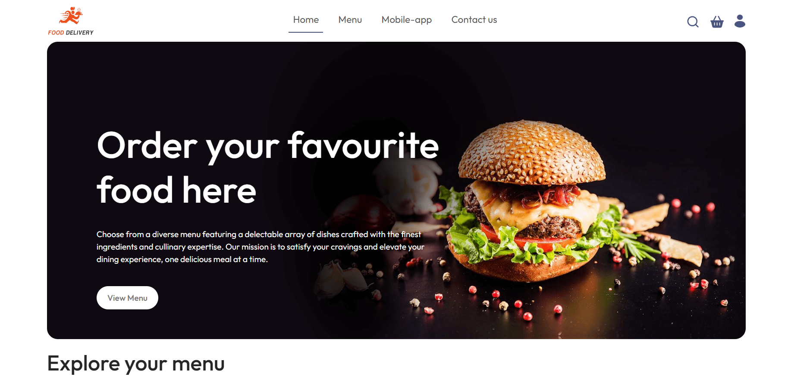
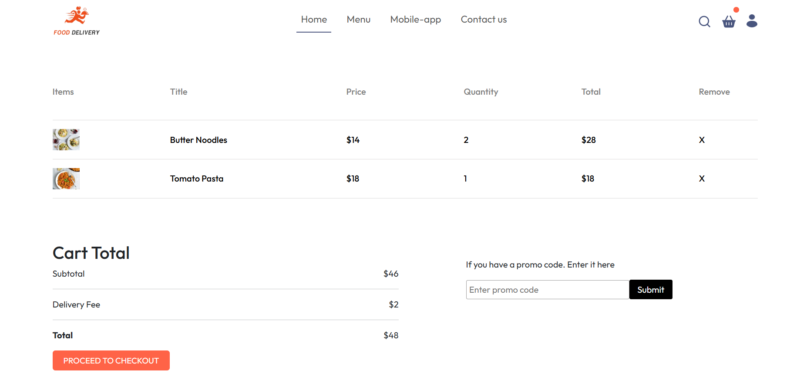
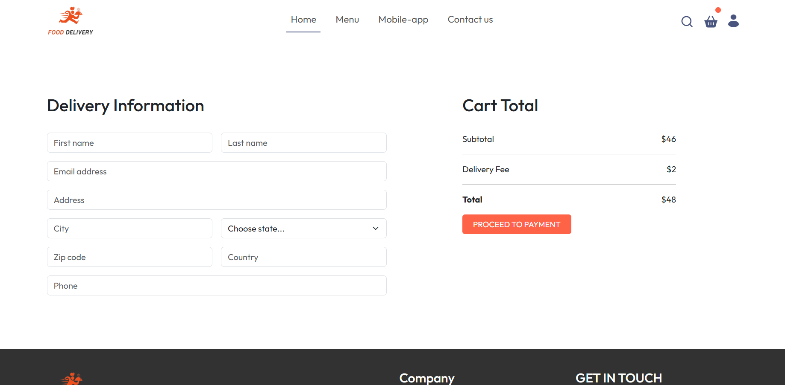
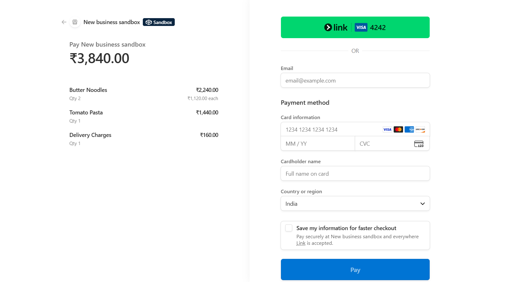
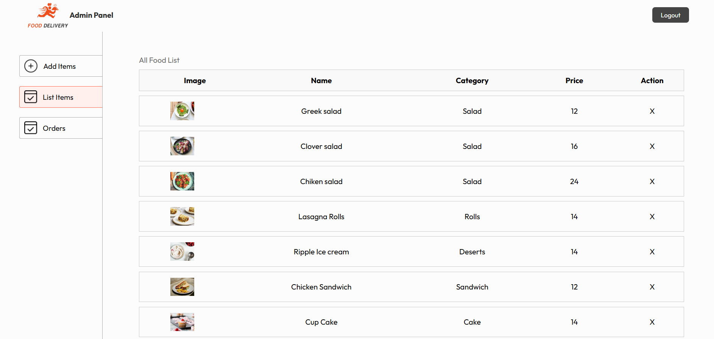

# 🍔 Food Delivery App (MERN Stack)

A full-featured **Food Delivery Web Application** built using the **MERN Stack** with an **Admin Panel** and **Stripe Payment Integration (Test Mode)**.

It includes user authentication, restaurant/food listing, cart functionality, order management, and an admin panel for managing food items and orders.

---

## 📌 Project Overview

This is a **practice-based MERN stack project** inspired by real-world food delivery platforms like **Zomato / Swiggy**.

The goal of this project is to understand:
- Full-stack application flow
- Admin & user separation
- Payment gateway integration 
- Clean architecture 

---

## 🚀 Features

### 👤 User Features
- User authentication (JWT)
- Browse food items
- Add items to cart
- Place food orders
- **Stripe payment integration (Test Mode only)**

### 🧑‍💼 Admin Panel Features
- Add food items
- List & manage food items
- View all orders
- Update order status
- Protected admin routes

---

Example Stripe Test Card:
- Card Number: 4242 4242 4242 4242
- Expiry: Any future date
- CVC: Any 3 digits

  
---

## 🛠️ Tech Stack

### 💻 Frontend
- React.js (Vite)
- JavaScript (ES6+)
- HTML5, CSS3
- Bootstrap

### ⚙️ Backend
- Node.js
- Express.js
- RESTful APIs
- JWT Authentication

### 🗄️ Database
- MongoDB
- Mongoose

### 💳 Payment Gateway
- Stripe (Test Environment)

---

## 📂 Project Structure
```
food-delivery-app/
│
├── admin/ # Admin Panel
│ ├── public/
│ ├── src/
│ └── vite.config.js
│
├── frontend/ # User Frontend
│ ├── public/
│ ├── src/
│ └── vite.config.js
│
├── backend/
│ ├── config/
│ ├── controllers/
│ ├── middleware/
│ ├── models/
│ ├── routes/
│ ├── uploads/
│ ├── .env
│ └── server.js
│
└── README.md
```

---

## ⚙️ Installation & Setup

### Backend
```bash
cd backend
npm install
npm start
```
.env file:
```
PORT=5000
MONGO_URI=your_mongodb_uri
JWT_SECRET=your_jwt_secret
STRIPE_SECRET_KEY=your_stripe_test_key
```
Frontend (User)
```
cd frontend
npm install
npm run dev
```
Admin Panel
```
cd admin
npm install
npm run dev
```
## 📸 Screenshots

### 🏠 Home Page
<p align="center">
  
</p>

### 🛒 Cart & Payment
<p align="center">
  
  
  
</p>

### 🧑‍💼 Admin Panel
<p align="center">
  
</p>


⭐ Show Your Support

If you like this project, please ⭐ star the repository!

🔥 Final Note

This project is built to demonstrate real-world MERN stack skills,
clean architecture, and production-ready practices.

